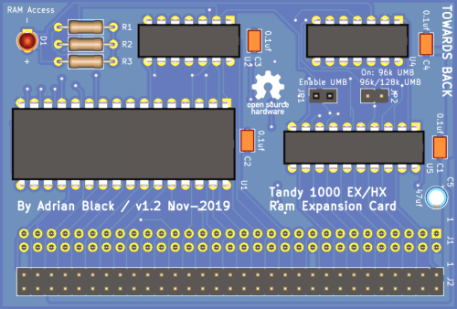
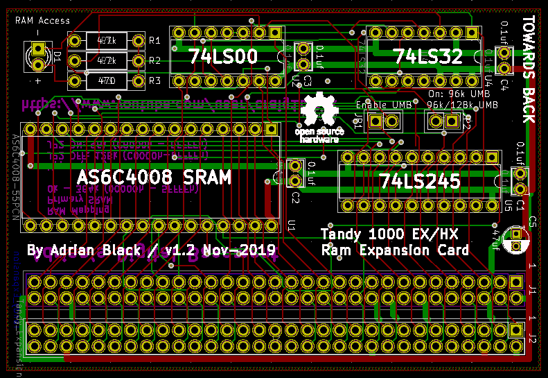

# Tandy 1000 EX / HX RAM Expansion Board

*Designed by* ***Adrian Black***

A ***cheap*** & ***simple*** expansion  
that only requires `3-4 ICs`.

*Tested for both* ***EX*** *&* ***HX*** *machines*

---

**⸢ [Video] ⸥ ⸢ [PCB] ⸥ ⸢ [Gerber Files] ⸥**

---

    
    

---

## Assembly

##### 3 ICs

If you bypass the `74LS245` with  
a jumper you can save one **IC**.

##### LED

If you don't want the **LED**, you  
can leave it off as well as `R3`.

##### 74HCT

If you choose to use the `74HCT`, you will  
just have to replace `R1` & `R2` with `10kΩ`.

---

## Files

Created with **[KiCAD]** `v5.1.4-1`

The uploaded files are of `version 1.2`, with  
the fixes, talked about in the **[Video]**, applied.

<!----------------------------------------------------------------------------->

[Video]: https://www.youtube.com/watch?v=l3RWOZX58A8
[PCB]: Source
[Gerber Files]: Gerbers

[KiCAD]: https://www.kicad.org/
